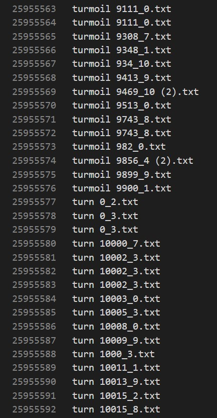

[![Contributors][contributors-shield]][contributors-url]
[![Forks][forks-shield]][forks-url]
[![Stargazers][stars-shield]][stars-url]
[![Issues][issues-shield]][issues-url]
[![Closed Issues][issues-closed-shield]][issues-closed-url]
[![pull requests][pull-req-shield]][pull-req-url]
[![closed pull requests][pull-closed-shield]][pull-closed-url]
[![milestones][milestones-shield]][milestones-url]
[![MIT License][license-shield]][license-url]


<br />
<p align="center">
  
  <h3 align="center">Inverted Index Construction</h3>

  <p align="center">
    The second project of the Information Retrieval & Web Search course  
  <br />
    Inverted Index (BSBI) 
    <br />
    (Spring 2021)
<br />

  

<!-- TABLE OF CONTENTS -->
<details open="open">
  <summary>Table of Contents</summary>
  <ol>
    <li>
      <a href="#about-the-project">About The Project</a>
      <ul>
        <li><a href="#built-with">Built With</a></li>
      </ul>
    </li>
    <li>
      <a href="#getting-started">Getting Started</a>
      <ul>
        <li><a href="#prerequisites">Prerequisites</a></li>
        <li><a href="#installation">Installation</a></li>
      </ul>
    </li>
    <li><a href="#usage">Usage</a></li>
    <li><a href="#how-it-works">How it Works</a></li>
    <li><a href="#testing-and-screenshots">Testing and Screenshots</a></li>
    <li><a href="#license">License</a></li>
  </ol>
</details>


<!-- ABOUT THE PROJECT -->
## About The Project

As for large collections that rely on secondary storage, the primary requirement for an external sorting algorithm is that any disk seeks it does during sorting be as few as possible, It's due to the fact that sequential disk reads are faster than single unit seeks.  A solution to this issue is the blocked sort-based indexing algorithm (A.K.A BSBI).  

After segmenting the collection into blocks of equal size, BSBI sorts the termID-docID pairs of every block in memory, stores intermediate sorted results on disk, and ultimately merges all intermediate results into the final index.

Because of sorting time complexity, BSBI has a time complexity of O( **T** * Log_2 **T** ) where **T** is the upper bound of the number of items we must sort (the number of termID–docID pairs). Typically, however, the amount of time actually spent indexing depends largely on the amount of time it takes to parse the documents (ParseNextBlock) and perform the final merge (MergeBlocks).  


### Built With


* [Python](https://www.python.org)
* [NLTK library](https://www.nltk.org)
* [PyCharm](https://www.jetbrains.com/pycharm)


<!-- GETTING STARTED -->
## Getting Started

To get a local copy up and running follow these simple example steps.

### Prerequisites

* Python 3, An IDE 

* nltk, string, collections, sys, os libraries installed

* Git

### Installation

1. Clone the repo
 ```sh
   git clone https://github.com/benymaxparsa/Inverted-Index-Construction.git
 ```
2. Install nltk required data  
2. Run the code :) 


<!-- USAGE EXAMPLES -->
## Usage

Put all of your documents in a single folder at the "Datasets/input" path, and do not separate them into different folders.   
You can run the code now, and based on the number of inputs, you will see the result index in the output directory after a while.  
if you want to change input/output directory go back to main.py and define the path for your input folder, then specify where the results will be saved.  

  
## How it Works
  To learn more about the algorithm and how it works click [here](BSBI/README.md)  
  To see the code click [here](BSBI/BSBI_Indexer.py)
  
  
  
## Testing and Screenshots  
  We used a dataset containing 100,000 documents for testing, click [here](Datasets/input.7z) to download  
  You can extract it by using [7-zip](https://www.7-zip.org/)  
  
  ### Screenshots:  
    
  *In this case, 40 MB was set as our block size*  
  
    
  *Having processed 14,338 documents, the program switched to the second block once the first block had been filled.*  
  
    
  *Once all 100,000 documents had been processed, the program stopped making new blocks and switched to merging mode. All 8 blocks were merged using 7 rounds of merging*  
  
    
  *This is our output directory before the program removed the block and merged temp files, The block sizes are not displayed properly for some unknown reason!*  
  
  
    
  *Here are two examples of how the final index output looks*
  
  
  
<!-- LICENSE -->
## License

Distributed under the MIT License. See `LICENSE` for more information.


  

## Project Members:  

First and Last Name | Student Number | Username
--- | --- | ---
Parsa KamaliPour | `97149081` | [Link](https://github.com/benymaxparsa)
Mohammad Mahdi Afkhami | `97149008`  | [Link](https://github.com/mohmehdi)


<!-- MARKDOWN LINKS & IMAGES -->
<!-- https://www.markdownguide.org/basic-syntax/#reference-style-links -->
[contributors-shield]: https://img.shields.io/github/contributors/benymaxparsa/Inverted-Index-Construction?style=for-the-badge
[contributors-url]: https://github.com/benymaxparsa/Inverted-Index-Construction/graphs/contributors
[forks-shield]: https://img.shields.io/github/forks/benymaxparsa/Inverted-Index-Construction?style=for-the-badge
[forks-url]: https://github.com/benymaxparsa/Inverted-Index-Construction/network/members
[stars-shield]: https://img.shields.io/github/stars/benymaxparsa/Inverted-Index-Construction?style=for-the-badge
[stars-url]: https://github.com/benymaxparsa/Inverted-Index-Construction/stargazers
[issues-shield]: https://img.shields.io/github/issues/benymaxparsa/Inverted-Index-Construction?style=for-the-badge
[issues-url]: https://github.com/benymaxparsa/Inverted-Index-Construction/issues
[issues-closed-shield]: https://img.shields.io/github/issues-closed/benymaxparsa/Inverted-Index-Construction?style=for-the-badge
[issues-closed-url]: https://github.com/benymaxparsa/Inverted-Index-Construction/issues?q=is%3Aissue+is%3Aclosed
[pull-req-shield]: https://img.shields.io/github/issues-pr/benymaxparsa/Inverted-Index-Construction?style=for-the-badge
[pull-req-url]: https://github.com/benymaxparsa/Inverted-Index-Construction/pulls
[pull-closed-shield]: https://img.shields.io/github/issues-pr-closed/benymaxparsa/Inverted-Index-Construction?style=for-the-badge
[pull-closed-url]: https://github.com/benymaxparsa/Inverted-Index-Construction/pulls?q=is%3Apr+is%3Aclosed
[milestones-shield]: https://img.shields.io/github/milestones/all/benymaxparsa/Inverted-Index-Construction?style=for-the-badge
[milestones-url]: https://github.com/benymaxparsa/Inverted-Index-Construction/milestones
[license-shield]: https://img.shields.io/github/license/benymaxparsa/Inverted-Index-Construction?style=for-the-badge
[license-url]: https://github.com/benymaxparsa/Inverted-Index-Construction/blob/main/LICENSE
